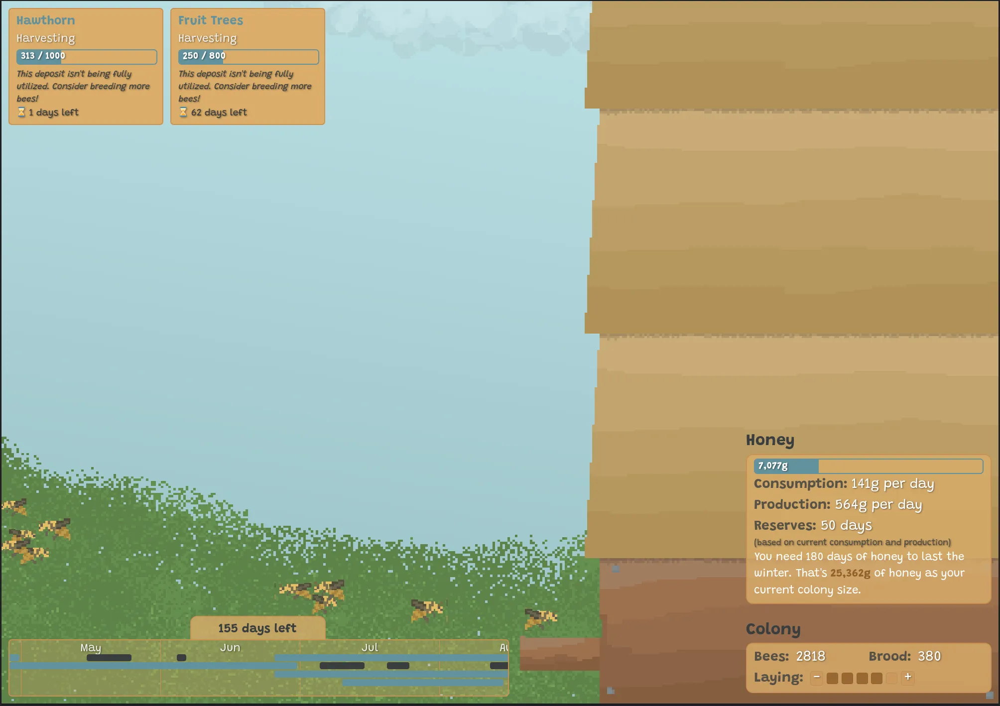

# Ludum Dare 56 - Honey for the Winter

My entry for Ludum Dare 56, built with TypeScript and my [custom game engine](https://github.com/tomaisthorpe/tedengine).

The goal of the game is to build enough honey reserves for your colony to survive through the coming winter. You must look for nectar sources when they become available, and manage the size of your colony to make the most of the nectar that’s available at the time.

[Play the game here](https://l56.ted.tomaisthorpe.com/) | [Ludum Dare submission](https://ldjam.com/events/ludum-dare/56/honey-for-the-winter)



## Controls

While managing the colony, you can control everything with your **mouse**.

While searching for nectar:
- **WASD** to move the bee
- **Space** to start harvesting the flowers

## Development

```bash
npm run dev
```
